# Concurrent Adaptive Replacement Cache

William Brown, SUSE Labs
<wbrown@suse.de>

2020-04-23

Caching is a very important aspect of computing, helping to improve the performance of applications
based on various work factors. Modern systems (especially servers)  are highly concurrent, so it is
important that we are able to provide caching strategies for concurrent systems. However, to date
the majority of work in concurrent data-structures has focused on lock free or systems that do not
require transactional guarantees. While this is applicable in many cases, it does not suit all
applications, limiting many applications to mutexes or read-write locks around existing
data-structures.

In this document, I will present a strategy to create a concurrently readable adaptive replacement
cache. This cache guarantees temporal consistency, as well as providing ACID guarantees, and
serialisable properties of the cache, while maintaining the invariants that define an adaptive
replacement cache. Additionally, this cache is able to support multiple concurrent readers with isolated
transactions, and serialised writers. This algorithm also has interested side effects with regard
to observing cache interactions, allowing it to have more accurate retention behaviour
of cached data.

## Concurrent Systems

To understand the reasons why a concurrent cache are relevant requires exploration of modern
concurrent systems. Modern CPU's while masquerading as a simple device that executes instructions
in order, are actually concurrent, out of order task execution machines, with asynchronous memory
views. At any point in time this means a CPU's view of memory will be either "latest" or any
point within a timeline into the past [fn 0].

This is due to each CPU's cache being independent to the caches of every other CPU in a system, both
within a die package and across a NUMA boundary. Updates to the memory from one CPU, requires
coordination based on the MESI [r 0]. Each cache maintains its own MESI state machine, and
they coordinate through inter-processor communication when required.

Examining MESI, it becomes apparent that it's best to keep cache-lines from becoming `Invalid` as
this state causes the highest level of inter processor communication to validate the content of the cache
which adds significant delays to any operation.

It becomes simple to see that the fastest lifecycle for memory should be that new memory is allocated
or used, which is set to `Exclusive`/`Modified`. Once all writeable actions have completed, the memory
may be accessed by other cores which moves the state to `Shared`. Only once all cores have completed
their operations, the memory is freed. At no point does it move through the `Invalid` state, which
has the highest penalties for inter-processor communication. This means that once a value becomes
`Shared` it can not be modified again in-place.

Knowing this, with highly parallel systems, we want to determine a method of keeping application
level memory in these states that helps to improve our systems performance. These states are
similar to concurrent readability, a property of systems where a single writer exists with many
parallel readers, but the parallel readers have a guaranteed snapshot (transaction) of memory. This
can be achieved through copy on write, which matches closely to the model of MESI states we want
to achieve.

As a result, applications that will benefit highly from these designs are:

* High concurrency read oriented
* Transactional

## Single Thread Adaptive Replacement Cache

ARC (Adaptive Replacement Cache) is a design proposed by IBM [r 1, 2], which improves upon strategies like
least replacement used. ARC was used with great success in ZFS [r 3] for caching of objects into
memory. A traditional LRU uses a single DLL (double linked list) with a fast lookup structure such as
a hash-map to offset into nodes of the DLL. ARC uses 4 DLL's, with lists for frequent, recent, ghost frequent
and ghost recent items to be stored, as well as a weight factor `p`. The operation of `p` is one
of the most important aspects of how ARC operates.

`p` is initially set to 0, and only increases toward positive numbers or back toward 0. `p`
represents "demand on the recent set". Initially, there is no demand on the recent set.

We start with an empty cache (of max size 4) and `p=0`. We add 4 elements, which are added to the
recent set (as they do not exist in any other set at this time). We then add another 4 items. This
displaces the original 4 element's keys to the ghost-recent set.

The 4 elements in the main cache are now accessed again. This promotes them from recent to frequent.

We then attempt to read from one element that in the ghost-recent set. We re-include the element into
the cache, causing there to be 3 elements in the frequent set, and 1 in the recent set. Since the key was
found in the ghost-recent set this indicates demand, so `p` is adjusted to 1. Assuming this process
happened again, this causes another element to be included in recent, so `p` adjusts again to 2.

If an item in the recent set now is touched again, it would be promoted to frequent, displacing
an item, so that frequent and recent both stay at size 2 (there is an empty slot now in recent).
An access to a new value, would be included in recent as there is a free slot available.

If we then miss on an item that was excluded from frequent by seeing it in the ghost set, this indicates
demand on frequent items, so `p` is reduced by 1. This would continue until `p` is 0.

It is important to note that the ghost set sizes are also affected by `p`. When `p` is 0, the ghost-frequent
size is 0, along with the recent set size of 0. The size of ghost-recent and frequent must therefore be
cache max. As p increases, ghost-frequent and recent are increased in size, while ghost-recent and frequent
decrease. This way as items are evicted and `p` shifts, we do not have a set of infinite items that
may cause evictions or `p` shifts unexpectedly.

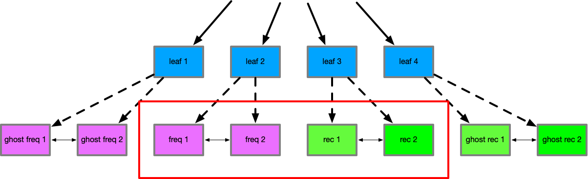
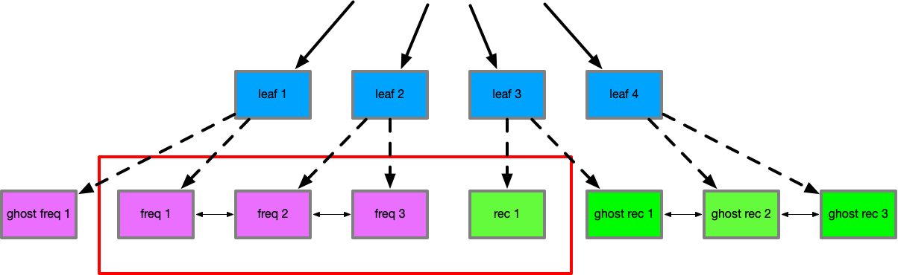

With the cache always adapting `p` between recent inclusions and high frequency accesses, the
cache is able to satisfy a variety of workloads, and other research [r 7] has shown it has a better hit
rate then many other cache strategies, for a low overhead of administration. Additionally, it is
resistant to a number of cache invalidation/poisoning patterns such as repeated hits on a single item causing
items to never be evicted (affects LFU) or scans of large sets causing complete eviction (affects LRU).

To explain, an item that is in the frequent set that is accessed many times in an LFU, would not
be able to be evicted as its counter has become very high and another item would need as many hits
to displace it - this may cause stale data to remain in the cache. However in ARC, if a frequent item
is accessed many times, but then different data becomes accessed highly, this would cause demand on
recent and then promotions to frequent, which would quickly displace the item that previously was
accessed many times.

In terms of resistance to scans, LRU on a scan would have many items evicted and included rapidly.
However in ARC, because many items may be invalidated and included, only the items in the ghost-recent
set would cause a change in the weight of `p`, so any other items stored in the frequent set would
not be evicted due to the scan.

This makes ARC an attractive choice for an application cache, and as mentioned has already been
proven through its use in systems like ZFS, and even the Linux Memory Management subsystem
has considered ARC viable [r 8].

However, due to the presence of multiple linked lists, and the updates required such as moving items
from one set to another, it's non possible to do this with atomic CPU instructions. To remain a
consistent data-structure, these changes must only be performed by a single thread. This poses
a problem to modern concurrent systems. A single thread cache behind a mutex or read write lock becomes
and obvious serialisation point, and having a cache per thread eliminates much of the value of
shared CPU caches as each CPU would have to have duplicated content - and thus smaller per
thread caches which may hinder large datasets from effective caching.

## Concurrent B+Tree

A concurrently readable B+tree design exists, and is used in btrfs [r 4]. The design of this is
so that any update copies only the affected tree node, and the nodes on the path to the leaf.
This means that on a tree with a large number of nodes, a single write only requires a copy
of a minimal set of nodes. For example, given a tree where each node has 7 descendants, and the
tree has 823543 nodes (4941258 key value pairs), to update a single node only requires 6 nodes
to be copied.

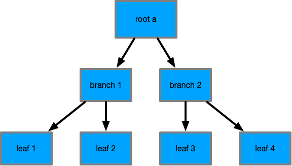
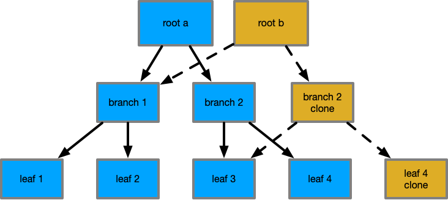
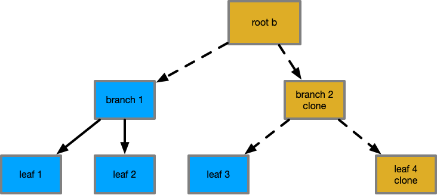

This copy on write property as previously described has a valuable property that if we preserve
previous tree roots, they remain valid and whole trees, where new roots point to their own complete
and valid tree. This allows readers across multiple transaction generations to have stable and
consistent views to a key-value set, while allowing parallel writes to continue to occur in the
tree. Additionally, because nodes are cloned, they are never removed from the `Shared` cache
state, with the new content becoming `Exclusive`/`Modified` until the new root is committed - at
which time initial readers will begin to see the new root and its value. The number of nodes that
require inclusion to perceive a new tree version is minimal, as many older nodes remain
identical and in their `Shared` state.

This has excellent behaviours for filesystems, but additionally, it's useful for databases as well.
Wired Tiger [r 5] uses a concurrent tree to achieve high performance for mongo db.

A question that arises is if this excess copying of data could cause excess cache invalidation
as there are multiple copies of the data now existing. This is certainly true that the copying would
have to invalidate some items of the CPU cache, however, those items would be the least recent
used items of the cache, but also that during a write the work-set would remain resident in the CPU's
L1 cache, without affecting the cache's of other CPUs. As mentioned the value of a copy on write
structure is that the number of updates required relative to the size of the dataset is small, which
also will limit the amount of CPU cache invalidation occurring.

## Concurrent ARC Design

To create a concurrently readable cache, some constraints must be defined.

* Readers must always have a correct "point in time" view of the cache and its data
* Readers must be able to trigger cache inclusions
* Readers must be able to track cache hits accurately
* Readers are isolated from all other readers and writer actions
* Writers must always have a correct "point in time" view
* Writers must be able to rollback changes without penalty
* Writers must be able to trigger cache inclusions
* Writers must be able to track cache hits accurately
* Writers are isolated from all readers
* The cache must maintain correct temporal ordering of items in the cache
* The cache must properly update hit and inclusions based on readers and writers
* The cache must provide ARC semantics for management of items
* The cache must be concurrently readable and transactional
* The overhead compared to single thread ARC is minimal

To clarify why these requirements are important - while it may seem obvious that readers
and writers must be able to track inclusions and hits correctly, when we compare to a read/write
lock, if the cache was in a read lock we could not alter the state of the ARC, meaning that
tracking information is lost - as we want to have many concurrent readers, it is important we track
their access patterns, as readers represent the majority of demand on our cache system.

In order to satisfy these requirements, an extended structure is needed to allow asynchronous
communication between the readers/writer and the ARC layer, due to ARC not being thread safe (double linked lists).

A multiple producer - single consumer (mpsc) queue is added to the primary structure, which allows
readers to send their data to the writer asynchronously, so that reader events can be acted on.
Additionally, an extra linked list called "haunted" is added to track keys that have existed in
the set. This creates the following pseudo structures:

    Arc {
        Mutex<{
            p,
            freq_list,
            rec_list,
            ghost_freq_list,
            ghost_rec_list,
            haunted_list,
            rx_channel,
        }>,
        cache_set,
        max_capacity,
        tx_channel,
    }

    ArcRead {
        cache_set_ro,
        thread_local_set,
        tx_channel,
        timestamp,
    }

    ArcWrite {
        cache_set_rw,
        thread_local_set,
        hit_array,
    }

The majority of the challenge is during the writer commit. To understand this we need to understand
what the readers and writers are doing and how they communicate to the commit phase.

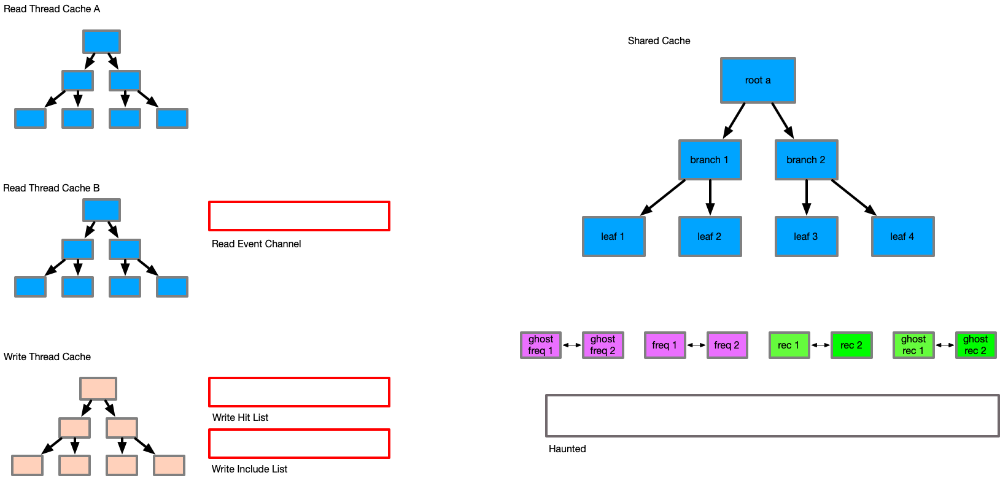

A reader acts like a normal cache - on a request it attempts to find the item in its thread local
set. If it is found, we return the item. If it is not found, we attempt to search the
read only cache set. Again if found we return, else we indicate we do not have the item. On a hit
the channel is issued a `Hit(timestamp, K)`, notifying the writer that a thread has the intent
to access the item K at timestamp.

If the reader misses, the caller may choose to include the item into the reader transaction. This
is achieved by adding the item to the thread local set, allowing each reader to build a small
thread local set of items relevant to that operation. In addition, when an item is added to the
thread local set, an inclusion message is sent to the channel, consisting of `Inc(K, V, transaction_id, timestamp)`.
This transaction id is from the read only cache transaction that is occurring.

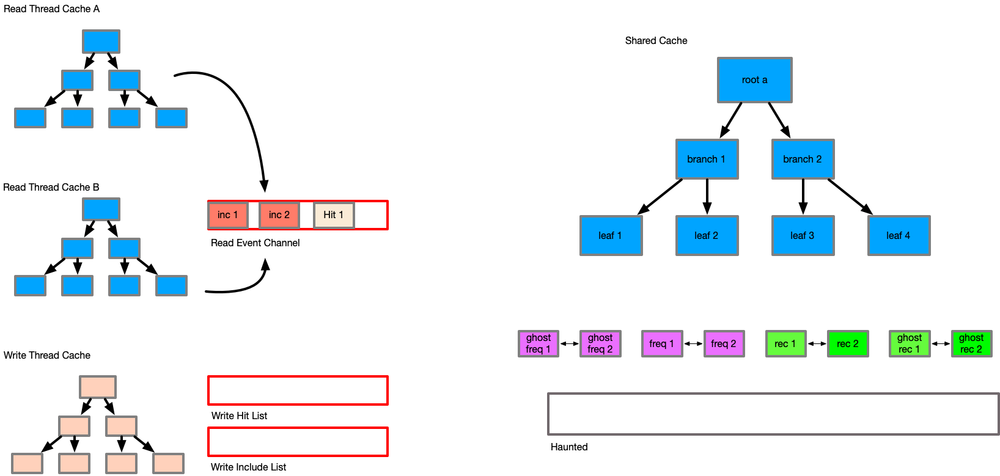

At the end of the read operation, the thread local set is discarded - any included items have been
sent via the channel already. This allows long running readers to influence the commits of
shorter reader cycles, so that other readers that may spawn can benefit from the inclusions of
this reader.

The writer acts in a very similar manner. During its operation, cache misses are stored into
the thread local set, and hits are stored in the hit array. Dirty items (new, or modified) may
be stored in the thread local set. By searching the thread local set first, we will always
return items that are relevant to this operation that may have been dirtied by the current
thread.

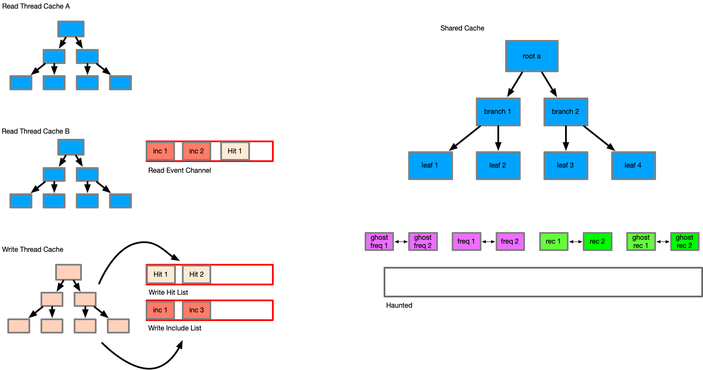

A writer does *not* alter the properties of the Arc during its operation - this is critical, as
it allows the writer to be rolled back at any time, without affecting the state of the cache
set or the frequency lists. While we may lose the details of the hit array from the writer, this is
not a significant loss of data in my view, as the readers hit data matters more.

It is during the commit of a writer, when the caller has confirmed that they want the changes in
the writer to now persist and be visible to future writers that we perform all cache management
actions.

### Commit Phase

During the commit of the writer we perform a number of steps to update the Arc state. First the
commit phase notes the current monotonic timestamp and the current transaction id of the writer.

The commit then drains the complete writer thread local state into the main cache, updating the
cache item states as each item is implied as a hit or inclusion event. Each item's transaction
id is updated to the transaction id of the writer.

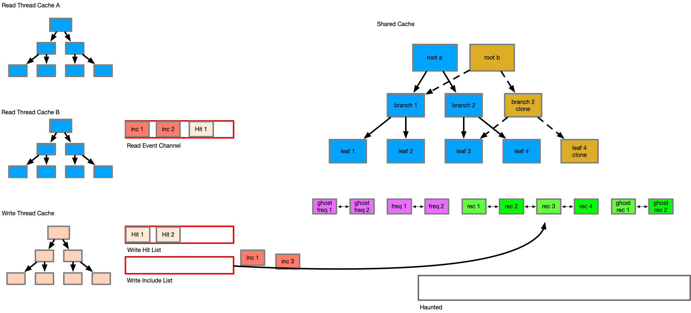

Next the commit drains from the mpsc channel until it is empty or the hit or include items timestamp
exceeds the timestamp from the start of the commit operation. This exists so that a commit will not
drain forever on a busy read cache, only updating the cache to the point in time at which the
commit phase began. Items from the channel are included only if their transaction id is equal to
or greater than the transaction id of the item existing in the cache. If the transaction id is
lower, this acts as a hit instead of an inclusion to affect the weightings of the caches.

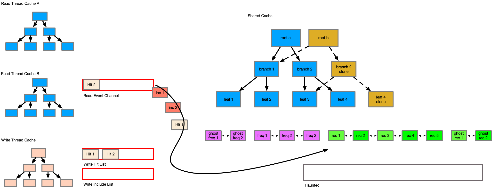

This detail, where items are only updated if their transaction id is greater or equal is one of
the most important to maintain temporal consistency, and is the reason for the existence of the
new haunted set. The haunted set maintains the transaction id of all keys when they were evicted from
the cache. Consider the following series of events.

    Reader Begins tx1
                        writer begins tx2
                        writer alters E
                        writer commit

                        reader begins tx3
                        reader quiesce -> Evict E

    reader reads E
    reader sends Inc(E)

                        reader quiesce (*)

In this sequence, as the reader at tx1 issues the inclusion, its view of entry E would be older
than the actual DB state of E - this would cause the inclusion of an outdated entry at the last
reader quiesce point, corrupting the data and losing changes. With the haunted set, the key to
item E would be in the haunted set from tx3, causing the include of E from tx1 to be tracked as
a hit rather than an include.
It is for this reason, that all changes to the cache must be tracked by transaction order,
and that the cache must track all items ever included in the haunted set to understand at what
transaction id they were last observed in the cache to preserve temporal ordering and consistency.

The commit then drains the writer hit set into the cache. This is because the writer exists
somewhat in time after the readers, so it's an approximation of temporal ordering of events, and
gives weight to the written items in the cache from being evicted suddenly.

Finally, the caches are evicted to their relevant sizes based on the updates to the p weight
factor. All items that are evicted are sent to the haunted set with the current transaction id
to protect them from incorrect inclusion in the future.

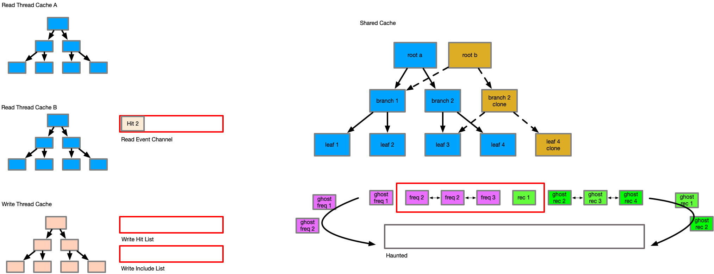

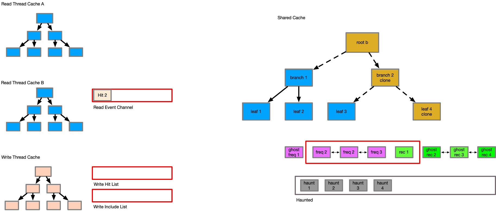

## Side Effects of this Algorithm

An interesting side effect of this delayed inclusion, and the batched eviction in the commit phase
is that the cache now has temporal observability, where we can have the effects from many
threads at many points in time updating the cache and its items. This gives the cache a limited
clairvoyance effect [6], so that items may not be evicted then rapidly included, rather remaining
in the cache, and that items that are evicted are less demanded by not just this thread, but
by the set of threads contributing to the channel and cache updates.

However, this comes at a cost - this algorithm is extremely memory intensive. A mutex cache will
always maintain a near perfect amount of items in memory based on the requested max. This system
will regularly, and almost always exceed that. This is because the included items in the queue
are untracked, each thread has a thread local set, the haunted set must keep all keys
ever perceived and that during the commit phase items are not evicted until the entire state is
known causing ballooning. As a result implementers or deployments may need to reduce the cache size
to prevent exceeding memory limits. On a modern system however, this may not be a concern in
many cases however.

Future changes could be to use bounded channels, and to have the channel drop items during high
memory pressure or high levels of include events, but this weakens the ability of the cache to have
a clairvoyant effect. Another option could be to split the hit and inclusion channels such that
the hits are unbounded due to their small size, and that it is the hit tracking that gives us the
insight into what items should be prioritised. Currently the thread sets are also unbounded, and
these could be bounded to help reduce issues.

## Relevant Applications

Applications which have a read-mostly, and serialised writes will benefit highly from this design.
Some examples are:

* LDAP
* Key-Value store databases
* Web-server File Caching

## Acknowledgements

* Ilias Stamatiss (Reviewer)

## References

* 0 - <https://en.wikipedia.org/wiki/MESI_protocol>
* 1 - <https://web.archive.org/web/20100329071954/http://www.almaden.ibm.com/StorageSystems/projects/arc/>
* 2 - <https://www.usenix.org/system/files/login/articles/1180-Megiddo.pdf>
* 3 - <https://www.zfsbuild.com/2010/04/15/explanation-of-arc-and-l2arc/>
* 4 - <https://domino.research.ibm.com/library/cyberdig.nsf/papers/6E1C5B6A1B6EDD9885257A38006B6130/$File/rj10501.pdf>
* 5 - <http://www.wiredtiger.com/>
* 6 - <https://en.wikipedia.org/wiki/Cache_replacement_policies#B%C3%A9l%C3%A1dy's_algorithm>
* 7 - <http://www.cs.biu.ac.il/~wiseman/2os/2os/os2.pdf>
* 8 - <https://linux-mm.org/AdvancedPageReplacement>

## Footnote

* 0 - It is yet unknown to the author if it is possible to have a CPU with the capability of predicting
the future content of memory and being able to cache that reliably, but I'm sure that someone is trying
to develop it.
